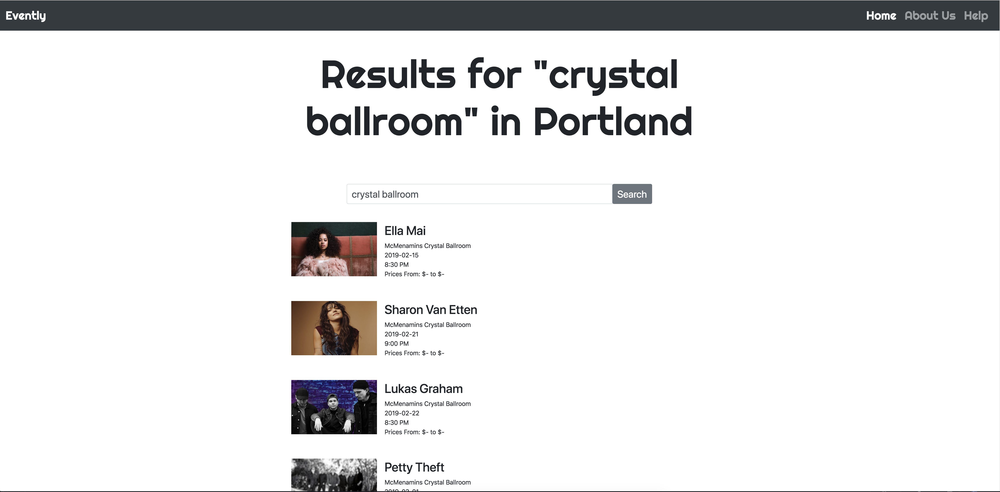

# Evently

An event finder for local Portland events using the Ticketmaster API.

## Getting Started

* View at https://justinhaupt.github.io/Evently
* Clone from https://github.com/justinhaupt/Evently.git
* Open in browser of your choice
* Edit files as desired

## Description

Use this webpage to search Portland, OR for artists, venues, and keywords like "music", "rap", "sports", "comedy" then you can purchase tickets thru Ticketmaster after clicking on a result.

##### Home page

 

##### Results page
 

## Authors

* **Leo Mangutov** - *Product/Project Manager* - [Github](https://github.com/Mangutov89)
* **Justin Haupt** - *CTO* - [Github](https://github.com/justinhaupt)
* **David Monarrez** - *CEO* - [Github](https://github.com/dmonarrez)
* **Dino Nguyen** - *CIO* - [Github](https://github.com/dinowins)

See also the list of [contributors](https://github.com/justinhaupt/Evently/contributors) who participated in this project.

## Specs

Specification | Input | Output
------------- | ----- | ------
The system will allow for users to search for events in Portland | "Music" | Results
The system will allow for users to search by venue, performer name, and other keywords|  |
Search results will display chronologically | |
Users will be able to navigate pages of results | Click previous | Go back 1 page
Clicking on event will link to Ticketmaster tickets page for that specific event | |
Users can click "Top" button to send them back to top of the page | |

## Known Bugs

* Search bar is not formatted properly for tablets.
* Nav bar for mobile is not properly formatted/functional - does not cover page.

## Acknowledgments

* Thanks to [Menelaos](https://codepen.io/menelaosly/pen/rZddyb) for search bar design.
* Grazie [Ticketmaster](https://developer.ticketmaster.com/) for concise API documentation.
* Danke sehr [Potasmic](https://stackoverflow.com/users/2076075/potasmic) for localStorage workaround.
* Domo Arigato [Travis](https://github.com/travisty12). You are awesome.

## License

Permission is hereby granted, free of charge, to any person obtaining a copy
of this software and associated documentation files (the "Software"), to deal
in the Software without restriction, including without limitation the rights
to use, copy, modify, merge, publish, distribute, sublicense, and/or sell
copies of the Software, and to permit persons to whom the Software is
furnished to do so, subject to the following conditions:

The above copyright notice and this permission notice shall be included in all
copies or substantial portions of the Software.

THE SOFTWARE IS PROVIDED "AS IS", WITHOUT WARRANTY OF ANY KIND, EXPRESS OR
IMPLIED, INCLUDING BUT NOT LIMITED TO THE WARRANTIES OF MERCHANTABILITY,
FITNESS FOR A PARTICULAR PURPOSE AND NONINFRINGEMENT. IN NO EVENT SHALL THE
AUTHORS OR COPYRIGHT HOLDERS BE LIABLE FOR ANY CLAIM, DAMAGES OR OTHER
LIABILITY, WHETHER IN AN ACTION OF CONTRACT, TORT OR OTHERWISE, ARISING FROM,
OUT OF OR IN CONNECTION WITH THE SOFTWARE OR THE USE OR OTHER DEALINGS IN THE
SOFTWARE.

Copyright (c) 2019 **_Leo Mangutov, Dino Nguyen, Justin Haupt, David Monarrez_**
